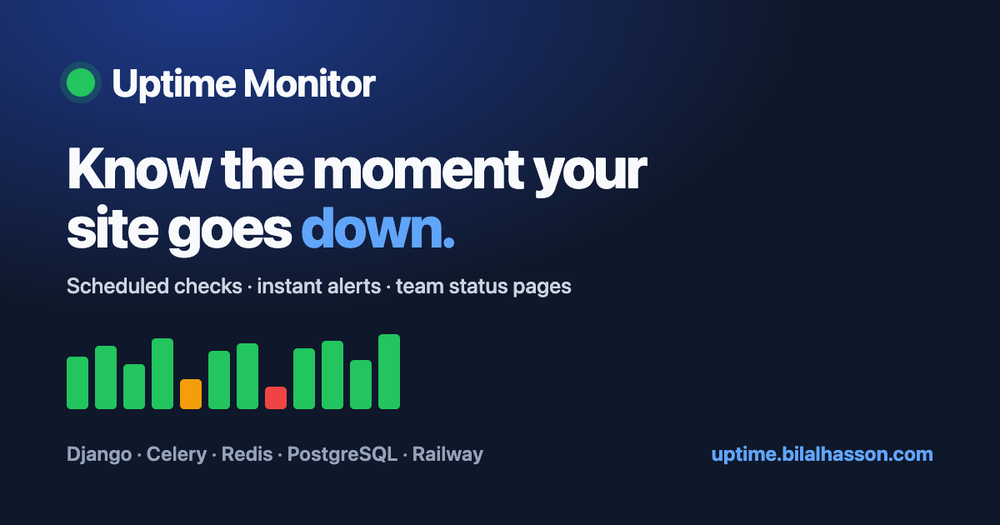
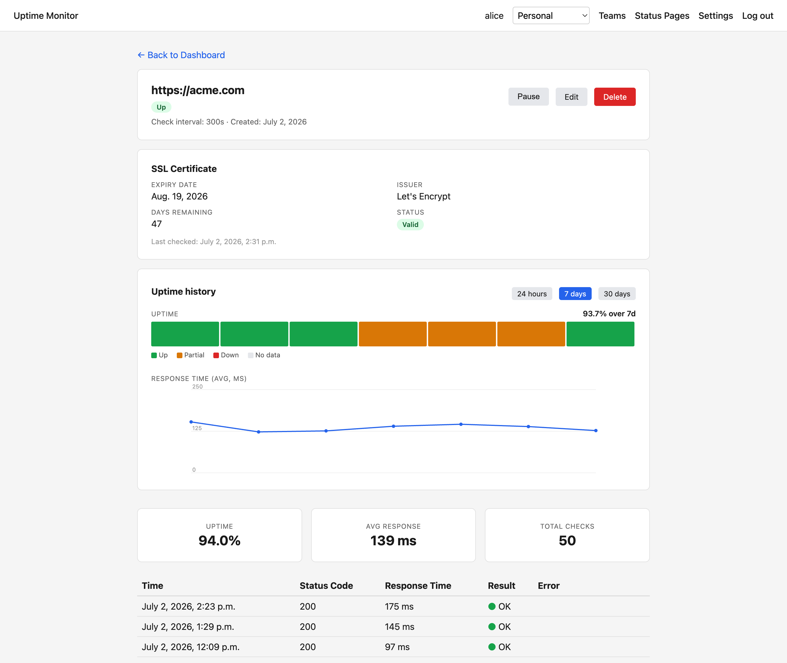
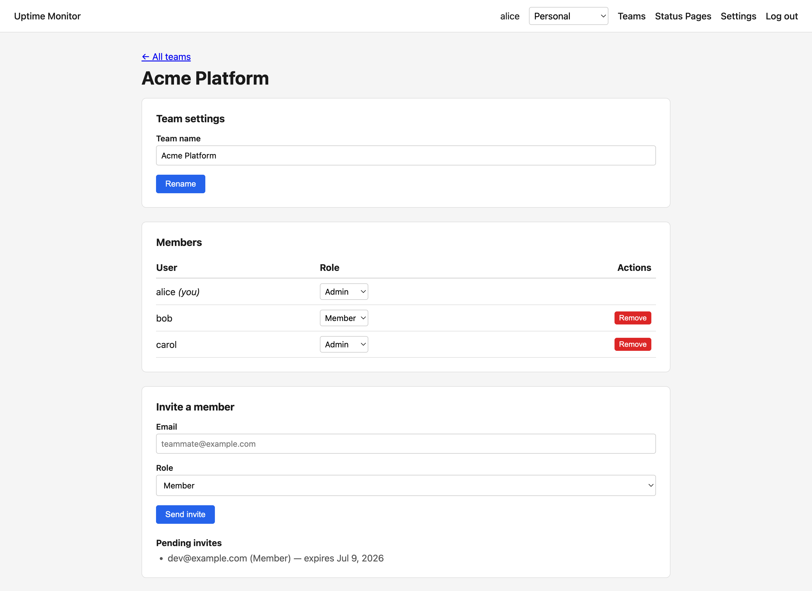
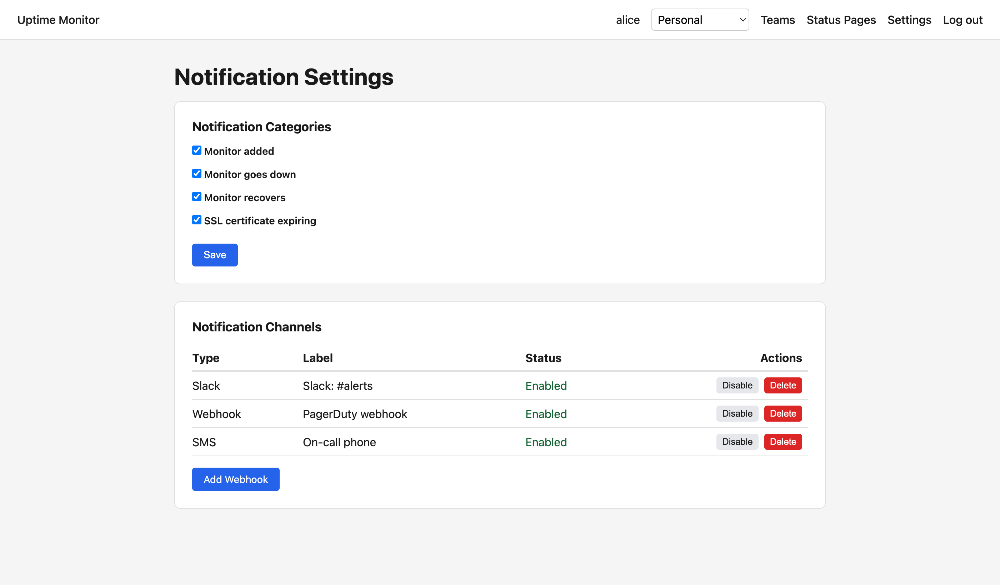
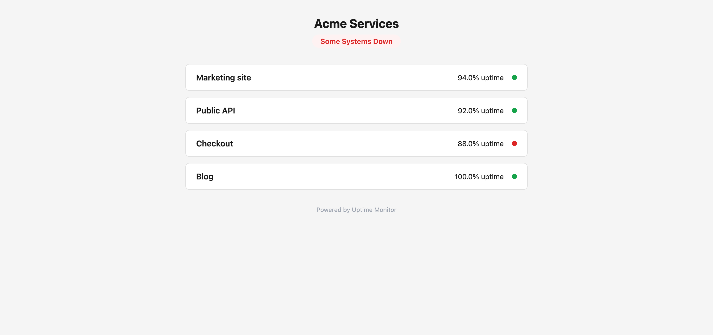
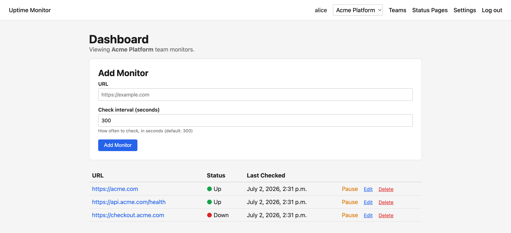
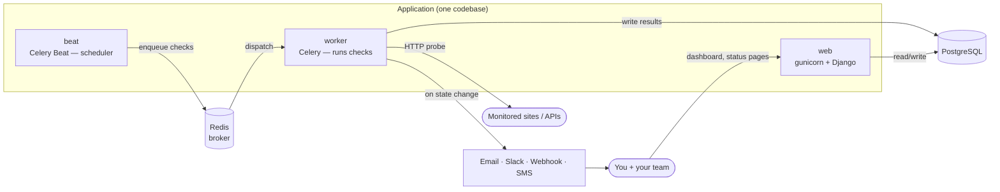

<div align="center">

# ● Uptime Monitor

### Know the moment your site goes down.

A production-grade website & API monitoring service — scheduled checks, instant
multi-channel alerts, team status pages, and uptime history at a glance.

[](https://uptime-monitor.demo.bilalhasson.com)
&nbsp;
[](https://github.com/bilalhasson/uptime-monitor/actions/workflows/ci.yml)


**[🔗 Live demo](https://uptime-monitor.demo.bilalhasson.com)** · **[📦 Source](https://github.com/bilalhasson/uptime-monitor)**

</div>



---

## What it is

Uptime Monitor watches your websites and APIs so you don't have to. Point it at a
URL and it checks the endpoint on a schedule; when a healthy response turns into an
error, a timeout, or a refused connection — or recovers — it tells you instantly,
across every channel you've configured. Along the way it tracks response times,
SSL-certificate expiry, and full uptime history, and it can publish a shareable
public status page for your users.

Commercial equivalents: UptimeRobot, Pingdom, Better Stack.

---

## Features

### 📈 Uptime history at a glance
Every monitor has a detail page with a **status-coloured uptime bar strip** and a
**response-time trend**, over a 24h / 7d / 30d window — rendered as dependency-free
inline SVG, aggregated efficiently in the database.



### 👥 Team sharing
Create a **team**, invite teammates by email, and share monitors. Ad-hoc by design —
solo users never see the concept. Admin/member **roles**, tokenised email invites,
and a per-session team switcher. When a shared monitor goes down, **every member**
is alerted via their own preferences.



### 🔔 Multi-channel alerts
Get notified the way your team actually works — **email** (Resend), **Slack**
(OAuth), **webhooks**, and **SMS** (Twilio) — with per-category preferences
(added / down / recovered / SSL expiring) that each user controls independently.



### 🌐 Public status pages
Publish a clean, no-login **status page** for any set of monitors, with live
status and uptime percentages. Great for keeping users informed during an incident.



### And more
- ⏱️ **Scheduled background checks** via Celery Beat — every monitor on its own interval
- 🔒 **SSL-certificate-expiry monitoring** with early-warning alerts
- ⏸️ **Pause / resume** monitors without losing history
- 📊 **Dashboard** with at-a-glance status and per-context (personal vs team) scoping
- 🧭 **Error tracking** wired to Sentry with release tracking via CI



---

## Tech stack

| Area | Tech |
|------|------|
| **Backend** | Django 6, Python 3.12 |
| **Async / scheduling** | Celery + Celery Beat, Redis (broker) |
| **Database** | PostgreSQL (prod), SQLite (dev) |
| **Notifications** | Resend (email), Twilio (SMS), Slack (OAuth), webhooks |
| **Frontend** | Server-rendered Django templates, inline SVG charts (no JS framework) |
| **Ops** | Railway, gunicorn, WhiteNoise, Sentry, GitHub Actions CI |

---

## Architecture

The app runs as three long-lived processes plus two managed services — the
interesting part is getting them to cooperate.



Two apps are documented in depth (with diagrams):
**[`notifications/`](notifications/README.md)** ·
**[`teams/`](teams/README.md)**

---

## Quickstart

**Prerequisites:** Python 3.12+, Docker (for Redis).

```bash
python3 -m venv venv && source venv/bin/activate
pip install -r requirements.txt
python manage.py migrate

# Start everything (Redis, web, Celery worker, Celery beat):
./dev.sh
```

Then open <http://localhost:8000>, sign up, and add a monitor. `./dev.sh` seeds a
dev superuser (`admin` / `password`). Press Ctrl+C to stop.

<details>
<summary>Run each process manually</summary>

```bash
docker compose up -d                                   # Redis
python manage.py runserver                             # web
celery -A uptime_monitor worker --loglevel=info        # worker
celery -A uptime_monitor beat --loglevel=info          # scheduler
```
</details>

---

## Configuration

All secrets are supplied via environment variables (never committed). The app runs
fine locally with none of these set — features degrade gracefully (e.g. email is
skipped and logged if `RESEND_API_KEY` is empty).

| Variable | Purpose |
|----------|---------|
| `SECRET_KEY`, `DEBUG`, `ALLOWED_HOSTS` | Core Django |
| `DATABASE_URL`, `REDIS_URL` | Postgres + Redis (provided by Railway plugins) |
| `RESEND_API_KEY`, `DEFAULT_FROM_EMAIL` | Email notifications |
| `SLACK_CLIENT_ID`, `SLACK_CLIENT_SECRET` | Slack OAuth |
| `TWILIO_ACCOUNT_SID`, `TWILIO_AUTH_TOKEN`, `TWILIO_FROM_NUMBER` | SMS |
| `SENTRY_DSN` | Error tracking |
| `SITE_URL` | Public base URL (used for social/OG image links) |

See **[DEPLOY.md](DEPLOY.md)** for the full Railway setup, custom domain, and
production static-file handling.

---

## Testing

```bash
python manage.py test
```

A suite of 243 tests covers models, views, ownership/team access, notification
dispatch, the uptime-graph aggregation, and edge cases. CI runs it on every push
and PR to `main`, and creates a Sentry release on green.

---

<div align="center">

**[🔗 uptime-monitor.demo.bilalhasson.com](https://uptime-monitor.demo.bilalhasson.com)** · **[📦 GitHub](https://github.com/bilalhasson/uptime-monitor)**

Built with Django, Celery, and Redis · deployed on Railway.

</div>
