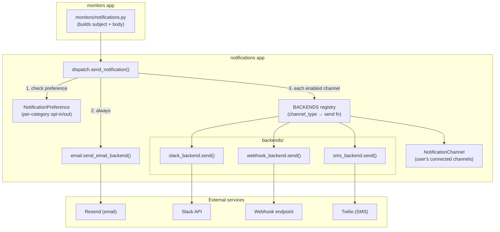
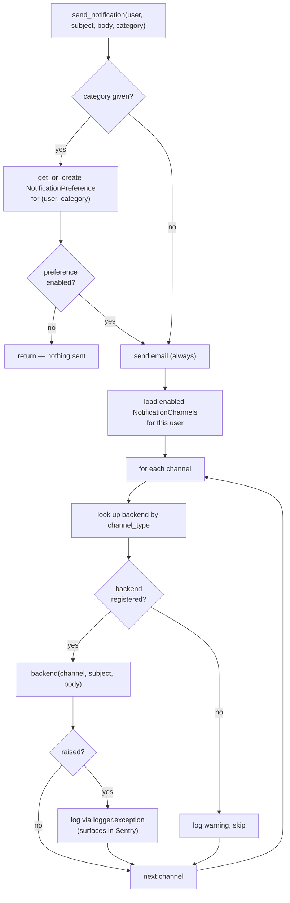
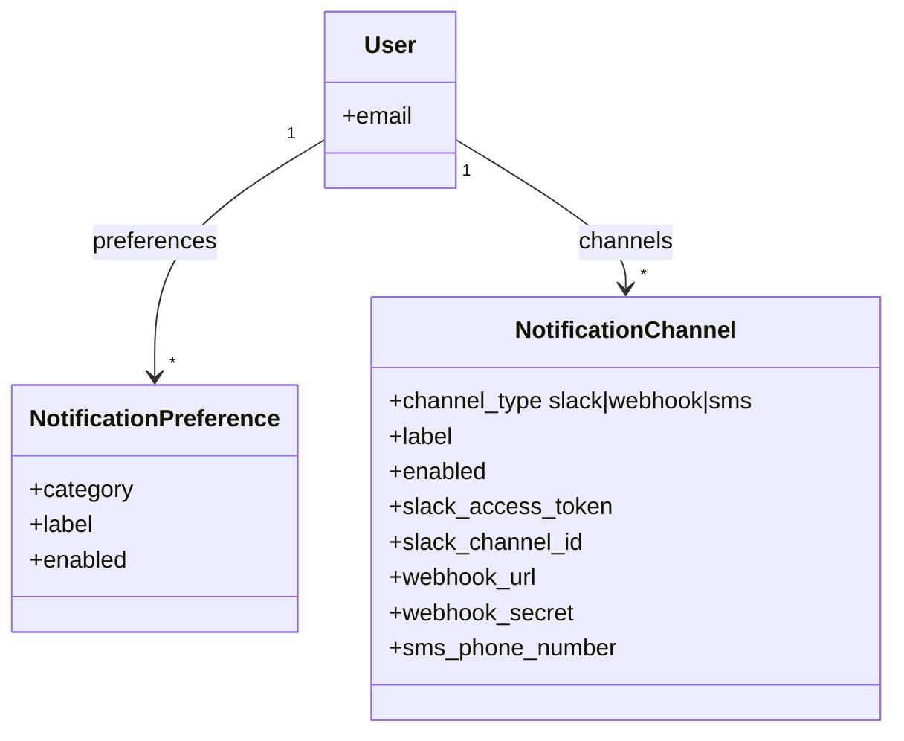
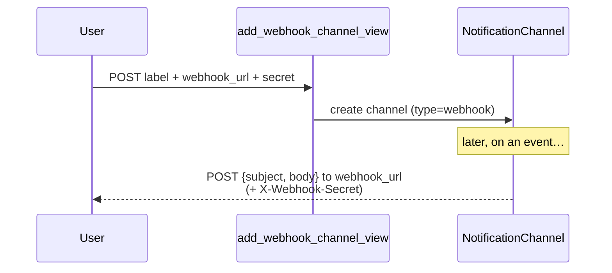
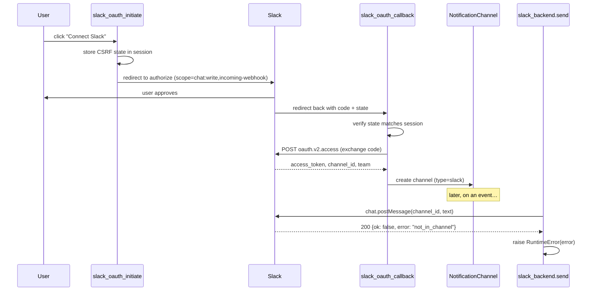
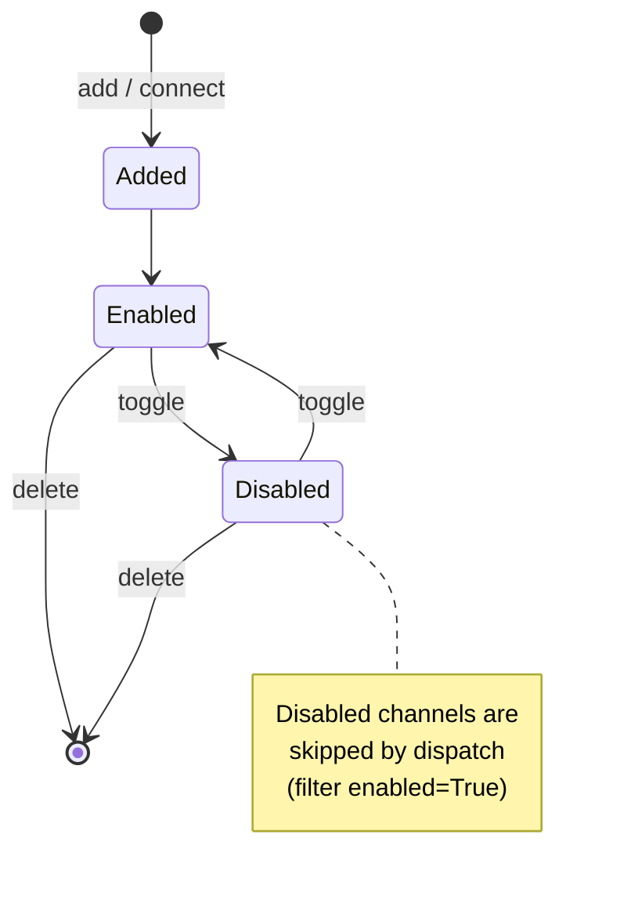

# Notifications

The `notifications` app is a **generic, channel-based notification system**. It is
fully decoupled from `monitors`: callers hand it a `user`, a `subject`, a `body`,
and an optional preference `category`. The app decides *who* to deliver to (based
on per-user preferences) and *how* (email plus any channels the user has connected).

Monitor-specific wording lives in `monitors/notifications.py`; this app knows
nothing about monitors, uptime, or SSL.

## Concepts

| Concept | Where | Purpose |
| --- | --- | --- |
| **Category** | `NotificationPreference` | A *type* of event (e.g. `monitor_down`). Users can opt out per category. |
| **Email** | `email.py` | Always-on baseline delivery via [Resend](https://resend.com). Not a channel. |
| **Channel** | `NotificationChannel` + `backends/` | An *additional*, user-connected destination: Slack, Webhook, or SMS. |
| **Backend** | `backends/*.py` | A `send(channel, subject, body)` callable that performs the actual delivery for one channel type. |
| **Dispatch** | `dispatch.py` | The single entry point that ties categories, email, and channels together. |

## Entry point

Everything flows through one function:

```python
from notifications.dispatch import send_notification

send_notification(user, subject, body, category="monitor_down", category_label="Monitor goes down")
```

`monitors/notifications.py` provides thin wrappers (`send_monitor_added_email`,
`send_monitor_down_email`, `send_monitor_recovery_email`, `send_ssl_expiring_email`)
that build monitor-specific copy and call `send_notification`.

## High-level architecture



## Dispatch flow

`send_notification` runs three steps in order (`dispatch.py`):



Key behaviours:

- **The category gate only guards email + channels together.** If the user
  disabled the category, nothing is sent at all.
- **Email is always attempted** (subject to the category gate). It is *not* a
  channel and has no on/off toggle beyond the category preference.
- **Channel failures are isolated.** Each backend call is wrapped in
  `try/except`; a failure is logged with `logger.exception(...)` and the loop
  continues to the next channel. Because Sentry's logging integration captures
  `ERROR`-level records, these handled failures still appear as Sentry issues
  (see the repo root [README](../README.md#error-tracking-sentry)).

## Data model



- `NotificationPreference` is unique per `(user, category)`. Categories are
  declared in `settings.NOTIFICATION_CATEGORIES` and created lazily on first use.
- `NotificationChannel` is a single table holding config for **all** channel
  types; only the fields relevant to `channel_type` are populated.

## The backend registry

Backends are registered lazily in `dispatch._register_backends()` so that
importing the app never eagerly imports `requests`, the Slack code, or the Twilio
SDK:

```python
BACKENDS = {
    ChannelType.WEBHOOK: webhook_backend.send,
    ChannelType.SLACK:   slack_backend.send,
    ChannelType.SMS:     sms_backend.send,
}
```

Every backend implements the same contract:

```python
def send(channel, subject, body):
    ...  # raise on failure; dispatch will catch and log
```

Each backend **short-circuits (returns silently) when its channel is not fully
configured**, and **raises on a real delivery failure** so dispatch can log it.

## Channels

### Email (baseline, not a channel)

- **File:** `email.py` · **Provider:** Resend
- Always attempted for every notification (subject to the category gate).
- Skipped with a warning if `RESEND_API_KEY` is unset or the user has no email.
- Swallows its own exceptions internally (logs, does not re-raise).

### Webhook

- **File:** `backends/webhook_backend.py` · **Setup:** `add_webhook_channel_view`
- POSTs JSON `{"subject", "body"}` to `channel.webhook_url`.
- Optional `webhook_secret` is sent as the `X-Webhook-Secret` header.
- Calls `response.raise_for_status()` — any non-2xx raises.



### Slack

- **Files:** `views_slack.py` (OAuth), `backends/slack_backend.py` (send)
- Connected via **Slack OAuth v2**, not a manual form. The user authorizes the
  app; the callback stores the bot `access_token`, `channel_id`, and channel/team
  names on a new `NotificationChannel`.
- Sends via `chat.postMessage`. Slack returns HTTP 200 even on logical errors, so
  the backend inspects `data["ok"]` and raises `RuntimeError` with the Slack
  error code (e.g. `not_in_channel` if the bot was never invited to the channel).



### SMS

- **File:** `backends/sms_backend.py` · **Setup:** `add_sms_channel_view` · **Provider:** Twilio
- User enters a phone number in **E.164** format (e.g. `+441234567890`).
- Requires `TWILIO_ACCOUNT_SID`, `TWILIO_AUTH_TOKEN`, and `TWILIO_FROM_NUMBER`
  settings; the "add SMS" UI is only offered when Twilio is configured.
- Truncates the message to Twilio's 1600-char limit.
- Twilio validates the destination server-side and raises
  `TwilioRestException` (HTTP 400) for an invalid `To` number.

## Managing channels (UI)

All channel management lives under `/settings/notifications/` (`urls.py`):

| Action | URL name | View |
| --- | --- | --- |
| View settings + list channels | `notification-settings` | `notification_settings_view` |
| Add webhook | `add-webhook-channel` | `add_webhook_channel_view` |
| Add SMS | `add-sms-channel` | `add_sms_channel_view` |
| Connect Slack (OAuth) | `slack-oauth-initiate` → `slack-oauth-callback` | `views_slack.*` |
| Enable/disable a channel | `toggle-channel` | `toggle_channel_view` |
| Delete a channel | `delete-channel` | `delete_channel_view` |



Toggle and delete are owner-scoped (`get_object_or_404(..., user=request.user)`)
and require POST.

## Relevant settings

```python
# uptime_monitor/settings.py
NOTIFICATION_CATEGORIES = [...]     # (category, label) pairs

RESEND_API_KEY / DEFAULT_FROM_EMAIL # email
SLACK_CLIENT_ID / SLACK_CLIENT_SECRET
TWILIO_ACCOUNT_SID / TWILIO_AUTH_TOKEN / TWILIO_FROM_NUMBER
```
