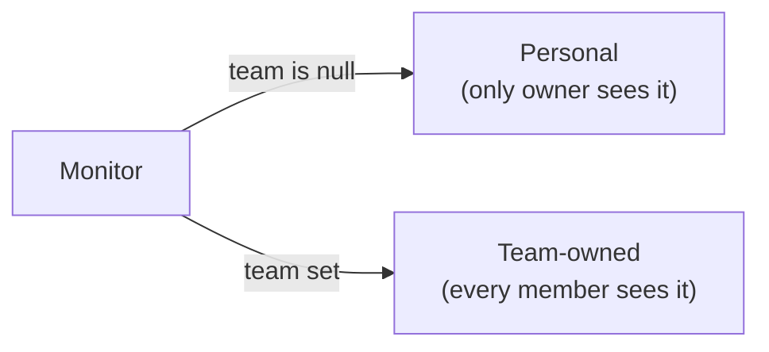
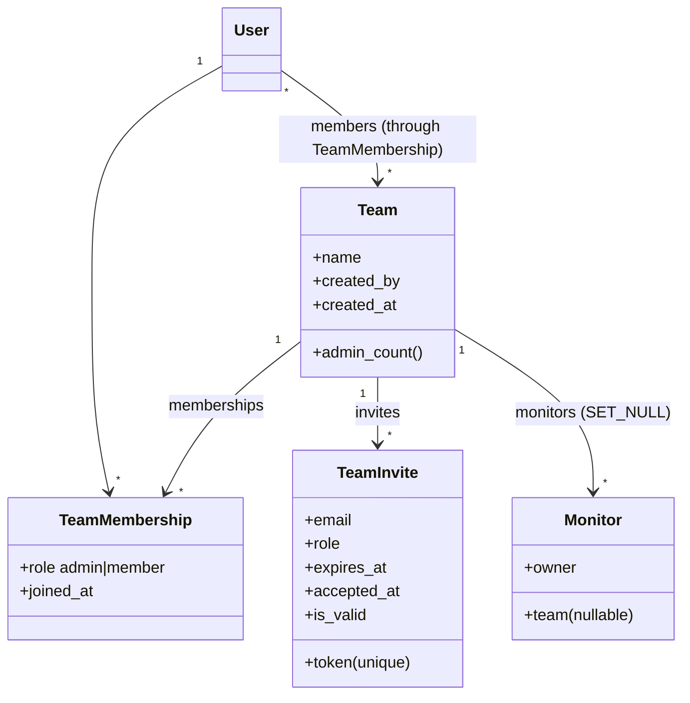
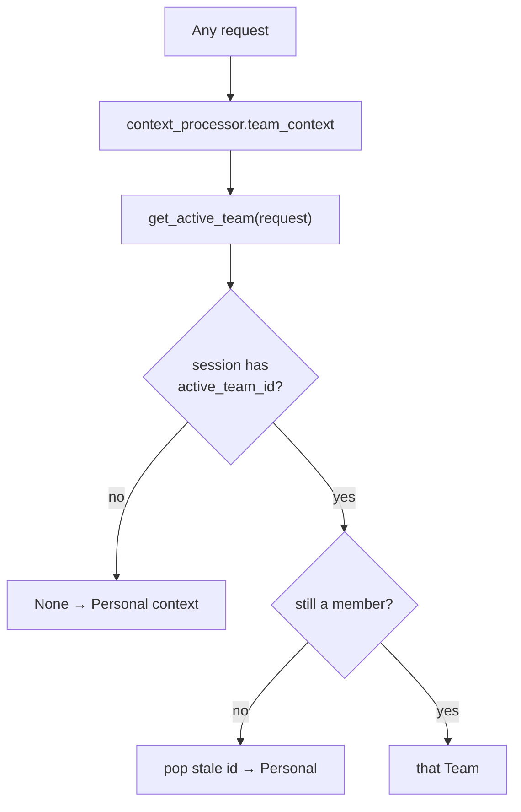
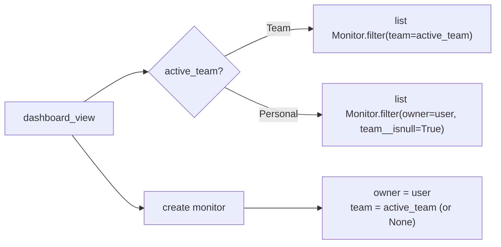
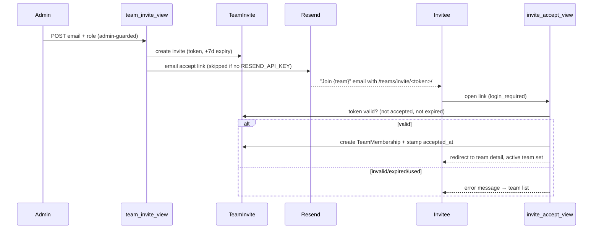
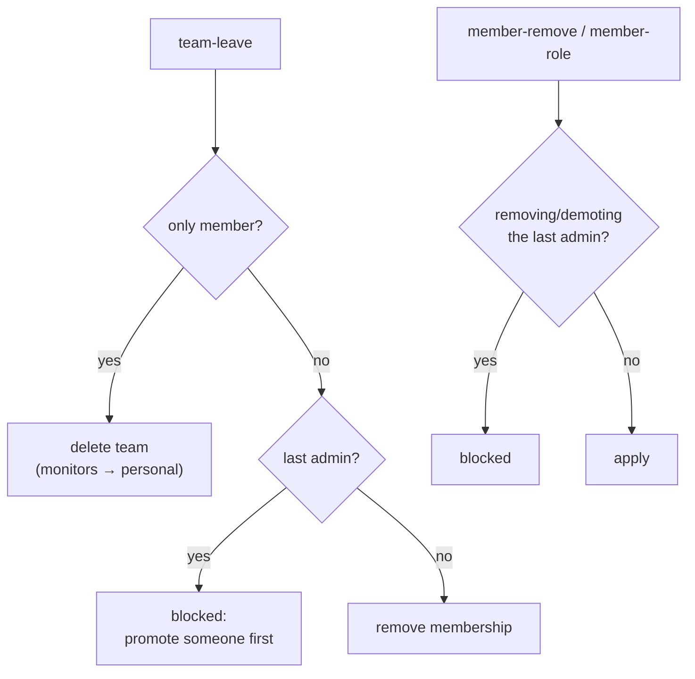

# Teams

The `teams` app adds **ad-hoc team accounts** so monitors can be shared. It is
deliberately decoupled: `teams` depends only on `django.contrib.auth` and never
imports `monitors`. The dependency runs one way — `monitors` references
`teams.Team` (a nullable FK) and reuses this app's membership helpers.

Solo users never encounter teams. A team exists only when someone deliberately
creates one; there is **no** team auto-created at signup.

## Core idea: hybrid ownership

A `Monitor` keeps its personal `owner` (a `User`) and gains a **nullable** `team`
FK. So a monitor is in one of two states:



Access is the union of both: **you can see/manage a monitor if you own it OR you
are a member of its team.** This single rule lives in `monitors/access.py`:

```python
def visible_monitors(user):
    return Monitor.objects.filter(Q(owner=user) | Q(team__members=user)).distinct()

def get_monitor_or_404(user, monitor_id):
    return get_object_or_404(visible_monitors(user), pk=monitor_id)
```

Every monitor view and the status-page monitor picker route through these, so the
sharing rule is defined in exactly one place.

## Roles

Two roles, stored on `TeamMembership`:

| Role | Manage team (invite / remove / rename / delete) | Manage monitors (CRUD) |
| --- | --- | --- |
| **admin** | ✅ | ✅ |
| **member** | ❌ | ✅ |

Because both roles can CRUD monitors, **monitor access needs only membership** —
roles gate *team management* only.

## Data model



- `TeamMembership` is unique per `(team, user)` — the `members` M2M is defined
  `through` it so `team.members` / `user.teams` both work.
- `Monitor.team` is `on_delete=SET_NULL`: deleting a team **reverts** its monitors
  to personal rather than deleting them.
- `TeamInvite.token` defaults to `secrets.token_urlsafe(32)`; `expires_at`
  defaults to +7 days. `is_valid` = not accepted **and** not expired.

## Active team & the nav switcher

A user can belong to several teams, so "which monitors am I looking at?" is
resolved by an **active team** kept in the session
(`session["active_team_id"]`). `teams/context_processors.py` exposes
`active_team` + `user_teams` to every template, and `base.html` renders a
switcher in the nav.



`get_active_team` self-heals: if the stored team no longer exists or the user was
removed from it, the stale id is dropped and the context falls back to Personal.

### How the active team drives the dashboard

`dashboard_view` scopes the monitor list and sets ownership on create:



Reassigning an existing monitor between Personal and a team is done on the
**edit** page via an owner `<select>`; `monitors/views.py:_resolve_team_choice`
only accepts a team the user actually belongs to (anything else falls back to
Personal), so you can't move a monitor into a team you're not in.

## Managing a team

All routes live under `settings/teams/` (`teams/urls.py`); the invite-accept link
lives at `teams/invite/<token>/`.

| URL name | Route | Guard | What it does |
| --- | --- | --- | --- |
| `team-list` | `settings/teams/` | member | List your teams + create form |
| `team-create` | `settings/teams/create/` | login | Create team; creator becomes **admin**; sets active team |
| `team-detail` | `settings/teams/<id>/` | member (else 404) | Members, roles, invite form |
| `team-rename` | `…/rename/` | admin (else 403) | Rename |
| `team-delete` | `…/delete/` | admin | Delete; monitors revert to personal |
| `team-invite` | `…/invite/` | admin | Create `TeamInvite`, email the link |
| `member-role` | `…/members/<uid>/role/` | admin | Change a member's role |
| `member-remove` | `…/members/<uid>/remove/` | admin | Remove a member |
| `team-leave` | `…/leave/` | member | Leave the team |
| `switch-team` | `settings/teams/switch/` | login | Set/clear active team in session |
| `invite-accept` | `teams/invite/<token>/` | login | Validate token → join |

Guards are enforced by two helpers in `teams/views.py`:
`_get_member_team_or_404` (404 for non-members) and `_require_admin` (403 for
non-admins).

### Invite → accept flow



The invite email is sent with `resend.Emails.send` directly (not the
notifications `send_email_backend`) because the recipient is an **email address**
that may not have a `User` account yet. It's skipped with a warning when
`RESEND_API_KEY` is unset — the invite row is still created so the flow works in
development.

### Leaving / deleting — the last-admin guard

The one rule that shapes several actions: **a team must never lose its last
admin.**



- **Remove / demote:** blocked if the target is the last admin
  (`team.admin_count() <= 1`).
- **Leave:** the sole member leaving deletes the team (its monitors revert to
  personal); a last-admin-with-other-members must promote someone before leaving.
- Deleting or leaving also clears the active-team session key if it pointed here.

## Notifications for shared monitors

`teams` owns no notification logic — `monitors/notifications.py` decides
recipients from the monitor's ownership:

```python
def _recipients(monitor):
    if monitor.team_id:
        return list(monitor.team.members.all())
    return [monitor.owner]
```

- **down / recovered / ssl-expiring:** fan out to **every** team member. Each call
  reuses the per-user `send_notification` pipeline, so every member's own
  `NotificationPreference` and personal channels (email/Slack/webhook/SMS) apply.
- **monitor-added:** notifies only the creator (`monitor.owner`) — avoids emailing
  the whole team about a monitor they didn't add.

See [`notifications/README.md`](../notifications/README.md) for how each
per-user delivery is dispatched.

## Files

```
teams/
├── models.py               # Team, TeamMembership, TeamInvite
├── views.py                # CRUD, invite/accept, member mgmt, switch-team
├── forms.py                # TeamForm, InviteForm
├── urls.py                 # settings/teams/… + teams/invite/<token>/
├── utils.py                # get_active_team, is_team_admin, user_teams, …
├── context_processors.py   # active_team + user_teams for the nav
├── admin.py
├── migrations/
└── templates/teams/{team_list,team_detail}.html

monitors/access.py          # visible_monitors / get_monitor_or_404 (the access rule)
```
